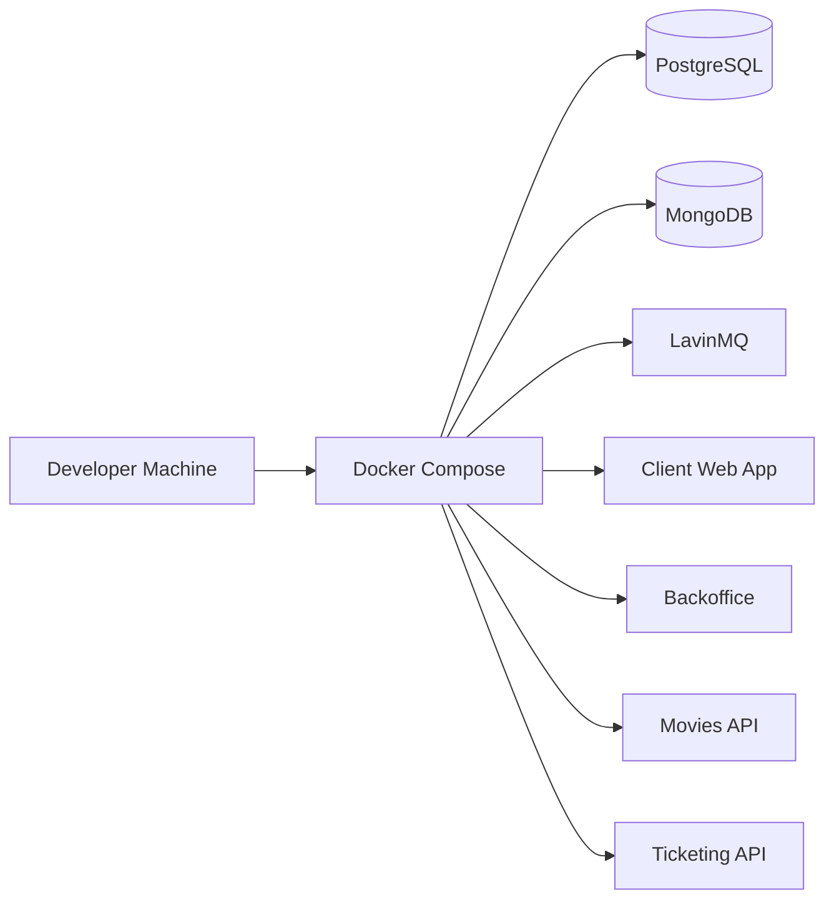

<div align="center">

# 🧪 HowestPrime Test Infrastructure

**A Docker-based integration environment for running the HowestPrime movie platform locally with its supporting services.**

<p>
  
  
  
  
  
  
</p>

</div>

> Local integration support for validating the system as a connected whole.

## 📑 Table of Contents

- [📖 About](#about)
- [🏗️ Architecture](#architecture)
- [✨ Features](#features)
- [📱 Service Access](#service-access)
- [🛠️ Tech Stack](#tech-stack)
- [🚀 Getting Started](#getting-started)
- [📄 License](#license)
- [👤 Author](#author)

## 📖 About

- This repository contains the local infrastructure and test setup for the HowestPrime movie platform.
- It brings together the backing services and the application endpoints used during integration testing.
- The stack is designed to make end-to-end validation repeatable on a developer machine.
- HTTP request files and setup notes live alongside the Docker configuration for convenience.

## 🏗️ Architecture



## ✨ Features

**🧩 Supporting services**

- PostgreSQL for the movies service.
- MongoDB for the ticketing service.
- LavinMQ for asynchronous messaging.

**🖥️ Application endpoints**

- Client web app for the public experience.
- Backoffice UI for staff workflows.
- Movies API and ticketing API for backend validation.

**🧪 Test utilities**

- HTTP request examples for quick API checks.
- Notes for building related container images.
- Repeatable startup and shutdown commands for local integration tests.

## 📱 Service Access

| Service | URL |
| --- | --- |
| Client WebApp | http://localhost:10200/ |
| Client Backoffice | http://localhost:10210/ |
| Movies API Swagger | http://localhost:40220/swagger |
| Ticketing API | http://localhost:40230/ |
| LavinMQ Management UI | http://localhost:40201/ |

## 🛠️ Tech Stack

| Area | Technologies |
| --- | --- |
| Containerization | Docker, Docker Compose |
| Database | PostgreSQL, MongoDB |
| Messaging | LavinMQ |
| API testing | HTTP request files |
| Supporting docs | Markdown |

## 🚀 Getting Started

### Prerequisites

- Docker
- Docker Compose
- Access to the required images or build context for the platform services

### Start the environment

```bash
docker compose -f howestprime-test/docker-compose.yml up -d --remove-orphans
```

### Stop the environment

```bash
docker compose -f howestprime-test/docker-compose.yml down
```

### Helpful references

- See `howestprime-test/run.md` for the environment commands and quick links.
- See `Commands.md` for the image build commands used by the related services.
- See `http_requests/http_files.md` for information about the HTTP request files.

## 📄 License

This project uses the Apache 2.0 License

## 👤 Author

| Name | GitHub | LinkedIn |
| --- | --- | --- |
| Maurice De Kegel | [MriceDK](https://github.com/MriceDK) | [LinkedIn](https://www.linkedin.com/in/dekegelmaurice/) |
